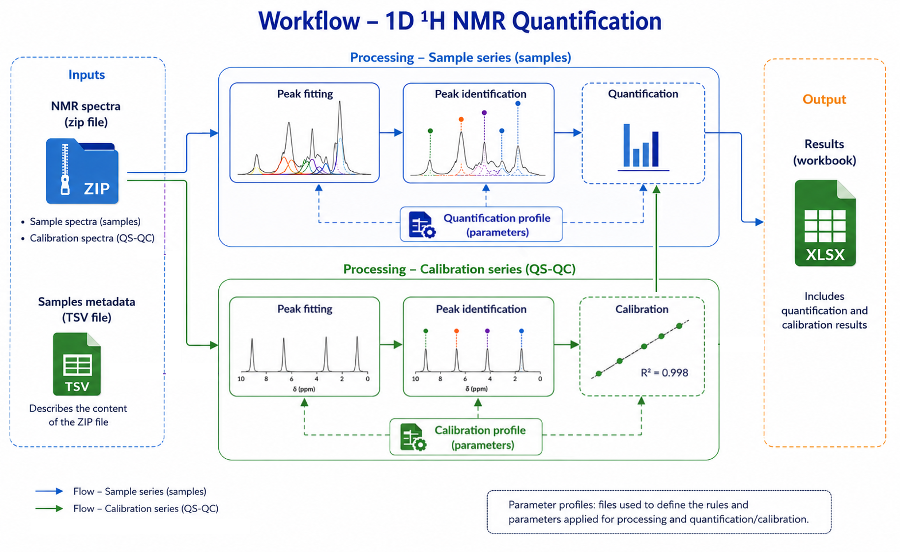

## **Quick Help**

 

#### **Funded by**

* <a href="https://www.bibs.inrae.fr/eng" target="_blank">INRAE UR BIA, BIBS</a>

#### **Main contributors**

* Daniel Jacob

#### **License**

* GNU GENERAL PUBLIC LICENSE Version 3, 29 June 2007 - See <a href="http://www.gnu.org/licenses/" target="_blank">http://www.gnu.org/licenses/</a> for more details.

### **Purpose**

**Application dedicated to 1D proton NMR quantification, including peak fitting and based on external calibration using standard spectra**

This application was initially developed as part of a project on wine authenticity. However, it is generic enough to be used on other biological and/or food matrices. This involves the implementation of an analytical protocol allowing quantification from an external standard (see references).

This application is designed around the <a href="https://github.com/djacob65/RnmrQuant1D" target="_blank">RnmrQuant1D</a> package, which forms its core. However, it is primarily designed for processing small batches of spectra (<100) more easily than in script mode. For larger batches, it is strongly recommended to switch to script mode (<a href="https://docs.posit.co/ide/user/" target="_blank">Rstudio</a> or <a href="https://jupyter.org/" target="_blank">JupyterLab</a>)

 

The figure below shows the **complete workflow for absolute quantification of compounds** implemented in the RnmrQuant1D package.

<a href="images/workflow.png" target = "_blank"></img></a>

The approach is based on

* an internal peak peaking followed by a deconvolution, also called _peak fitting_.
* an identification of the zones for each compound using a _quantification profile_, grouping all the parameters in the same file.
* a quantification relying on calibration using external standards.

 

See <a href="https://github.com/djacob65/RnmrQuant1D/wiki" target="_blank">Tutorial</a> for more details :
* on using the RnmrQuant1D package,
* preparing spectral data, sample metadata, quantification and calibration profiles.

 

**Reference**

   * Guillaume Leleu et al. (2026 ) 1H-NMR analysis of wine metabolites: Method development and validation, molecules, 31 (1), <a href="https://doi.org/10.3390/molecules31010065" target="_blank"> doi:10.3390/molecules31010065</a>
